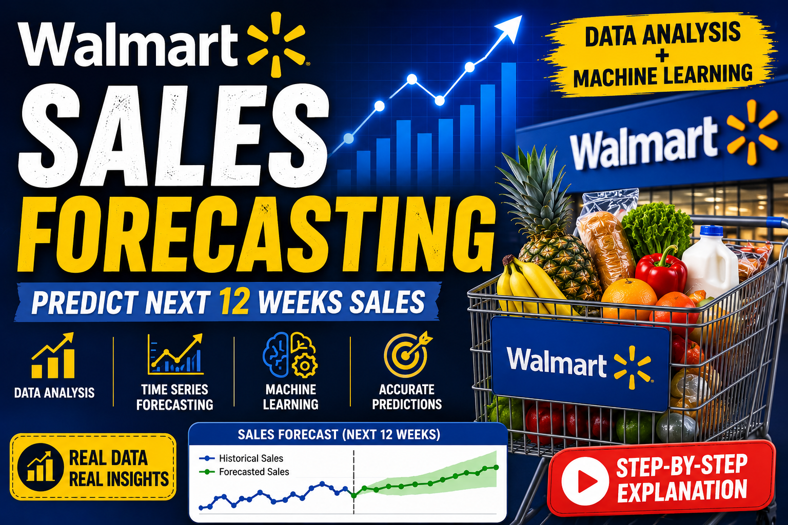
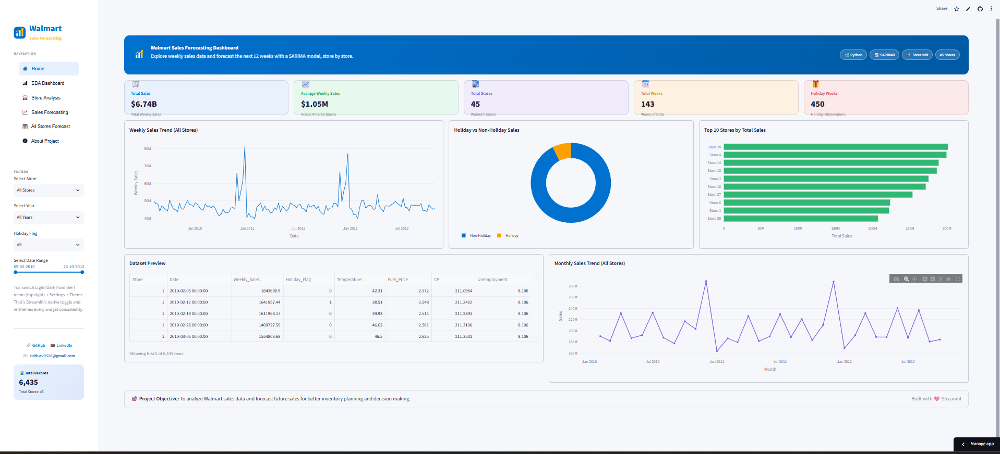
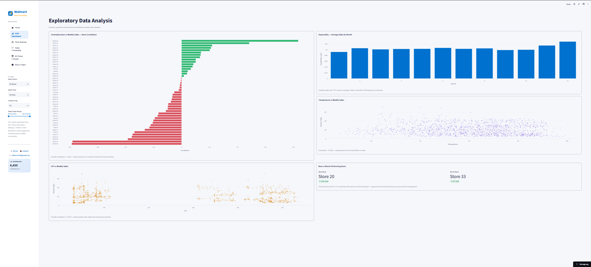
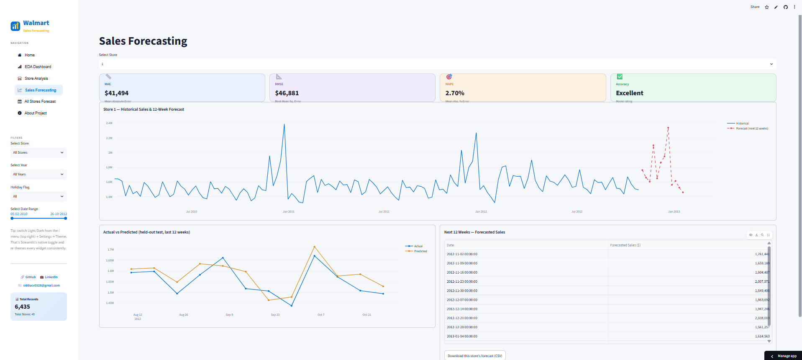

<div align="center">



# 🛒 Walmart Sales Forecasting Dashboard

**Forecasting weekly sales for 45 Walmart stores, 12 weeks ahead — with a seasonal time-series model wrapped in a full interactive dashboard.**

[](https://walmart-sales-forecasting-stores.streamlit.app/)
[](https://youtu.be/UXW4FTEN994)


*Built by [Siddu](https://github.com/sidducv0528) — B.Sc. Mathematics, Statistics & Data Science*

</div>

---

### ✨ Highlights

- 📈 **45 independent SARIMA models** — one per store, not a single chain-wide average
- 🎯 **3.66% average MAPE** — 44 of 45 stores rated Excellent (< 10% error)
- 🖥️ **6-page interactive dashboard** — live, filterable, deployed on Streamlit Cloud
- 🧠 **Honest modeling decisions** — exogenous variables tested and deliberately excluded, not just defaulted away
- 📄 **Fully documented** — report, methodology, pipeline diagram, and slide deck all included

---

## 📋 Table of Contents

- [Overview](#-overview)
- [Demo](#-demo)
- [Results at a Glance](#-results-at-a-glance)
- [Screenshots](#-screenshots)
- [Key EDA Findings](#-key-eda-findings)
- [Methodology](#-methodology)
- [Dashboard Pages](#️-dashboard-pages)
- [Tech Stack](#️-tech-stack)
- [Project Structure](#-project-structure)
- [Getting Started](#-getting-started)
- [Documentation](#-documentation)
- [Contact](#-contact)

---

## 🎯 Overview

Walmart operates 45 stores with very different sales patterns, seasonal
sensitivity, and economic exposure. This project builds a **store-level
forecasting system** — not a one-size-fits-all model — that predicts each
store's weekly sales 12 weeks into the future, evaluates its own accuracy,
and surfaces everything through a live, filterable dashboard.

> **In short:** raw sales data → EDA → 45 independent SARIMA models → accuracy
> evaluation → interactive Streamlit app, deployed and live.

## 📺 Demo

<div align="center">

[](https://youtu.be/UXW4FTEN994)

**🔴 [Watch the full video walkthrough](https://youtu.be/UXW4FTEN994)** &nbsp;·&nbsp; **🚀 [Open the live app](https://walmart-sales-forecasting-stores.streamlit.app/)**

</div>

> First load on the live app can take a few seconds — Streamlit Community
> Cloud's free tier spins containers down after inactivity.

## 📊 Results at a Glance

<div align="center">

| 📦 Records | 🏬 Stores | 🎯 Avg. MAPE | 🏆 Best Store | ⚠️ Watch List |
|:---:|:---:|:---:|:---:|:---:|
| **6,435** | **45** | **3.66%** | Store 37 — 1.64% | Store 35 — 14.15% |

</div>

44 of 45 stores land in the **Excellent** accuracy band (< 10% MAPE) — one
of the largest, most consistent results across the whole store network.

## 📸 Screenshots

<table>
<tr>
<td width="50%"><b>Home</b><br></td>
<td width="50%"><b>EDA Dashboard</b><br></td>
</tr>
<tr>
<td width="50%"><b>Store Analysis</b><br></td>
<td width="50%"><b>Sales Forecasting</b><br></td>
</tr>
<tr>
<td width="50%"><b>All Stores Forecast</b><br></td>
<td width="50%"><b>About Project</b><br></td>
</tr>
</table>

## 🔍 Key EDA Findings

| Finding | Detail |
|---|---|
| 🎄 **Seasonality dominates** | Sales peak sharply in Nov–Dec (Thanksgiving/Christmas); holiday weeks run ~7–8% higher than non-holiday weeks |
| 📉 **Unemployment & CPI: weak signal** | Both under 0.1 correlation with sales at the aggregate level — though a handful of stores are meaningfully more sensitive |
| 🌡️ **Temperature: minimal effect** | Correlation ≈ −0.02 — essentially no relationship with weekly sales |
| 🏪 **Store performance varies widely** | The best store sold **7×** the volume of the worst — the core reason this project forecasts *per store*, not chain-wide |

## 🧮 Methodology

**Model:** `SARIMA(1,1,1)(1,1,1,52)` — fit independently for **each of the 45
stores**. The seasonal order of 52 captures the yearly weekly cycle directly,
which drives the holiday-season spike in nearly every store.

<details>
<summary><b>📌 A note on model naming — SARIMA vs. SARIMAX (click to expand)</b></summary>
<br>

The dataset includes `Holiday_Flag`, `CPI`, and `Unemployment` as candidate
exogenous regressors. These were tested and **deliberately excluded** as
exogenous inputs, for two reasons backed directly by the EDA:

1. **Holiday effects are already captured** by the seasonal `(…,52)` term —
   adding `Holiday_Flag` separately would be largely redundant.
2. **CPI and Unemployment move slowly** month-to-month and showed weak
   correlation with weekly sales at the store level — unlikely to
   meaningfully improve a 12-week-ahead forecast.

This is implemented using statsmodels' `SARIMAX` class (which supports
`exog` inputs), but none are passed — functionally this is a **seasonal
ARIMA (SARIMA)** model, not true SARIMAX. Full reasoning and the correlation
checks behind it are documented in
[`documentation/Methodology.pdf`](documentation/Methodology.pdf).

</details>

**Evaluation:** the last 12 weeks of each store's history are held out as a
test set. MAE, RMSE, and MAPE are computed per store:

| MAPE | Rating |
|:---:|:---:|
| < 10% | 🟢 Excellent |
| < 20% | 🟡 Good |
| ≥ 20% | 🔴 Needs Improvement |

## 🖥️ Dashboard Pages

| Page | What it shows |
|---|---|
| 🏠 **Home** | KPI overview, sales trends, holiday split, top 10 stores — filterable by store/year/holiday/date |
| 📊 **EDA Dashboard** | Unemployment/CPI/temperature correlation, seasonality, best vs. worst store |
| 🏬 **Store Analysis** | Per-store deep dive — rank, holiday lift, economic sensitivity, monthly seasonality |
| 📈 **Sales Forecasting** | 12-week forecast per store, actual vs. predicted, MAE/RMSE/MAPE, CSV export |
| 📋 **All Stores Forecast** | Model accuracy across all 45 stores, sorted MAPE chart, best/worst 5, full table |
| ℹ️ **About Project** | Summary and methodology, right inside the app |

## 🛠️ Tech Stack

<table>
<tr>
<td><b>Language</b></td><td>Python (pandas, numpy)</td>
</tr>
<tr>
<td><b>Modeling</b></td><td>statsmodels — SARIMAX class, used as SARIMA</td>
</tr>
<tr>
<td><b>Dashboard</b></td><td>Streamlit, Plotly, streamlit-option-menu</td>
</tr>
<tr>
<td><b>Deployment</b></td><td>Streamlit Community Cloud, GitHub</td>
</tr>
</table>

## 📁 Project Structure

```
Walmart-Sales-Forecasting/
├── walmart_deploy/              ← deployed app (Streamlit Cloud entry point)
│   ├── app.py
│   ├── requirements.txt
│   ├── walmart_cleaned.csv
│   ├── forecast_next_12_weeks.csv
│   ├── model_evaluation_metrics.csv
│   ├── actual_vs_predicted_holdout.csv
│   └── .streamlit/config.toml
├── notebooks/                   ← full EDA + modeling + evaluation
├── scripts/precompute.py        ← regenerates the 4 CSVs above
├── data/raw/                    ← original untouched dataset
├── documentation/                ← report, methodology, workflow, slides
├── Demo/                        ← live app + video links
├── assets/screenshots/          ← images used in this README
└── .gitignore
```

## ▶️ Getting Started

```bash
git clone https://github.com/sidducv0528/Walmart-Sales-Forecasting.git
cd Walmart-Sales-Forecasting/walmart_deploy
pip install -r requirements.txt
streamlit run app.py
```

**Refreshing the forecast with new data:**

```bash
cd scripts
python precompute.py     # regenerates all 4 output CSVs (~7-8 min)
```

Commit and push — Streamlit Cloud redeploys automatically. Forecasts are
precomputed rather than fit live because a 52-week seasonal SARIMA across 45
stores takes several minutes — too slow to run on every page load.

## 📄 Documentation

| Document | Purpose |
|---|---|
| [📘 Walmart_Project_Report.pdf](documentation/Walmart_Project_Report.pdf) | Full written report, with screenshots |
| [🔬 Methodology.pdf](documentation/Methodology.pdf) | Deep dive into modeling and evaluation methodology |
| [🔄 Project_Workflow.pdf](documentation/Project_Workflow.pdf) | Visual end-to-end pipeline diagram |
| [🖥️ Walmart_Presentation.pptx](documentation/Walmart_Presentation.pptx) | Slide deck version |

## 📬 Contact

<div align="center">

[](https://github.com/sidducv0528)
[](https://linkedin.com/in/siddu-data/)
[](mailto:sidducv0528@gmail.com)

</div>

---

<div align="center">

📄 Licensed under [MIT](LICENSE) &nbsp;·&nbsp; ⭐ If this project was useful, consider starring the repo

</div>
